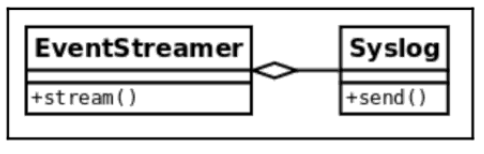
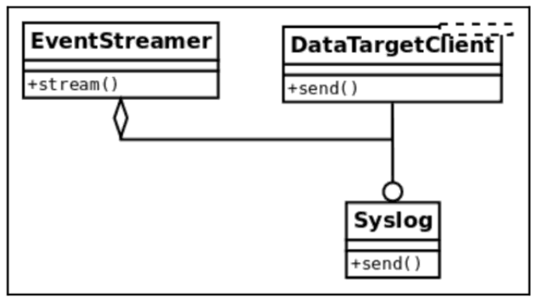

# SOLID 원칙

SOLID는 코딩 기술이나 디자인 패턴과 같은 설계 방식이 아니라 디자인 패턴이나 클린 코드를 만들기 위한 원칙(Principal)이다. (디자인 패턴의 종류에 대한 자세한 내용은 9장에 나온다.)

* Single Responsibility (SRP): 단일 책임 원칙
* Open/Close (OCP): 개방/폐쇄의 원칙
* Liskov Substitution (LSP): 리스코프 치환 원칙
* Interface Seperation (ISP): 인터페이스 분리 원칙
* Dependency Inversion (DIP): 의존성 역전 원칙

## 1. 단일 책임 원칙 (SRP)

* 하나의 컴포넌트(클래스)는 하나의 일에 대해서만 책임져야 한다.
* 잘못 설계된 컴포넌트는 너무 많은 책임을 하나의 컴포넌트(god 객체?)에 맡긴다.
* 응집력 있는 추상화(유닉스 철학)
* 클래스의 메쏘드는 상호 배타적이며 서로 관련이 없어야 한다.

### 너무 많은 책임을 가진 클래스

* 로그파일이나 데이터베이스에서 이벤트 정보를 읽어서 로그 별로 필요한 액션을 분류하는 클래스
* 개략적인 코드

``` python
# srp_1.py
class SystemMonitor:

  def load_activity(self):
    """ 소스에서 처리할 이벤트 가져오기 """

  def identify_events(self):
    """ 가져온 데이터를 파싱하여 도메인 객체 이벤트로 변환 """

  def stream_events(self):
    """ 파싱하 이벤트를 외부 에이전트로 전송 """
```

* 이 코드의 문제점
  * 특정 소스로 부터 로그를 가져오는 로더 기능
    * 데이터 소스에 연결한다.
    * 데이터를 로드한다.
    * 데이터를 필요하 모양으로 파싱하다.
  * 데이터 구조가 바뀌면 파싱하고 전송하는 부분을 모두 수정해야 한다.

### 책임 분산

* 메서드 한 개당 하나의 클래스로 분리하여 각 클래스마다 단일 책임을 갖게 한다.
  * 각 클래스마다 명확한 기능을 갖게 되다.
  * 기능별로 클래스로 캡슐화 된다.
  * 각 클래스의 유지보수가 쉽다.
  * 그렇다고 클래스 하나당 메서드가 반드시 한개여야 한다느 것은 아니다. 처리할 관심사가 같은 경우 하나의 클래스에 여러 메서드를 추가할 수 있다.

## 2. 개방/패쇄 원칙 (OCP)

* **하나의 모듈은 개방되어 있으면서도 폐쇄되어야 한다.(? 뭔소린가)**
* 클래스(모듈)를 설계 할 때 클래스의 확장에는 개방되어 있어야 하고, 수정에는 폐쇄되어 있어야 한다는 원칙. ---> 그래야 유지보수가 쉽다.
* 새로운 요구 사항이 발생했을 때 새로운 것을 추가만 할 뿐 기존 코드는 그대로 유지해야 한다는 뜻...(무슨 뜬구름 잡는 소리인가)

> 질문 : 파이썬은 기본적으로 모든 데이터와 메서드가 public 인 것으로 알고 있다. close 를 한다면 어떤 방법으로 close 한다는 것인가? 문법만으로는 close 할 수 있는 방법이 없는 것 아닐까?

### 개방/패쇄 원칙을 따르지 않을 경우 유지보수의 어려움

### 확장성을 가진 이벤트 시스템으로 리펙토링

### 이벤트 시스템 확장

### OCP 최종 정리

## 3. 리스코프 치환 원칙 (LSP)

> 만약 S가 T의 하위 타입이라면 프로그램을 변경하지 않고 T 타입의 객체를 S 타입의 객체로 치환 가능해야 한다.

### 도구를 사용해 LSP 문제 검사하기

### 애매한 LSP 위반 사례

### LSP 최종 정리

## 4. 인터페이스 분리 원칙 (ISP)

* 질문 : 파이썬은 타입을 구분하지 않고 메서드가 있고/없고 만을 가지고 타입을 판단한다고 알고 있다. (duck typing) 그럼 파이썬에는 인터페이스를 따로 정의할 필요도 없고 인터페이스를 위한 별도의 문법이 필요 없는 것 아닌가?

### 너무 많은 일을 하는 인터페이스

### 인터페이스는 작을 수록 좋다

### 얼마나 작아야 할까

## 5. 의존성 역전 (DIP)

> 의존성 주입(Dependency Injection, DI)은 프로그래밍 에서 구성요소간의 의존 관계가 소스코드  내부가 아닌 외부의 설정파일 등을 통해 정의되게 하는 디자인 패턴   중의 하나이다. (출처: 위키백과)

* 질문 : 의존성을 역전시키려면 의존성을 주입해주는 프레임워크를 만들어야 한다. 파이썬은 주로 의존성 역전을 위해 어떤 프레임워크(혹은 컨테이너)를 사용하는가?
* Django 같은 웹 프레임워크에서 주로 사용한다.

### 엄격한 의존의 예

{ width="50%" }

### 의존성을 거꾸로



#### 참고

* 파이썬에서의 의존성 주입 문제 해결: <https://ashon.github.io/2019/11/02/di-in-python.html>
